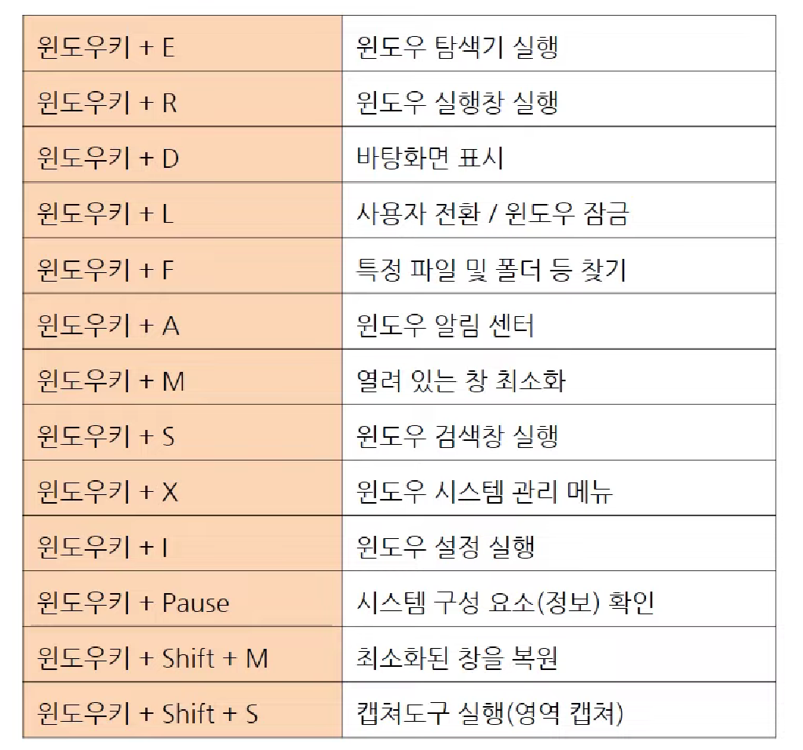
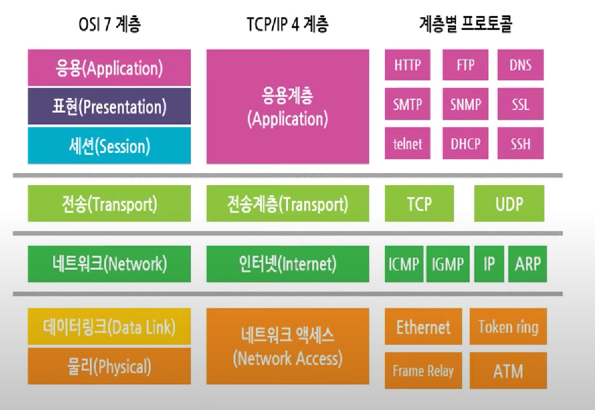
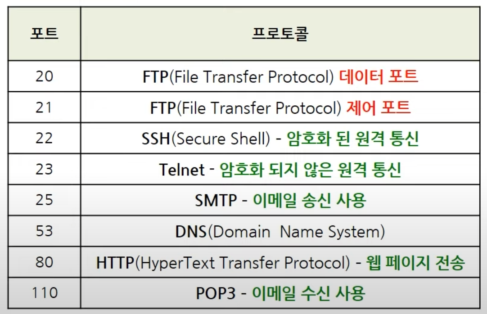
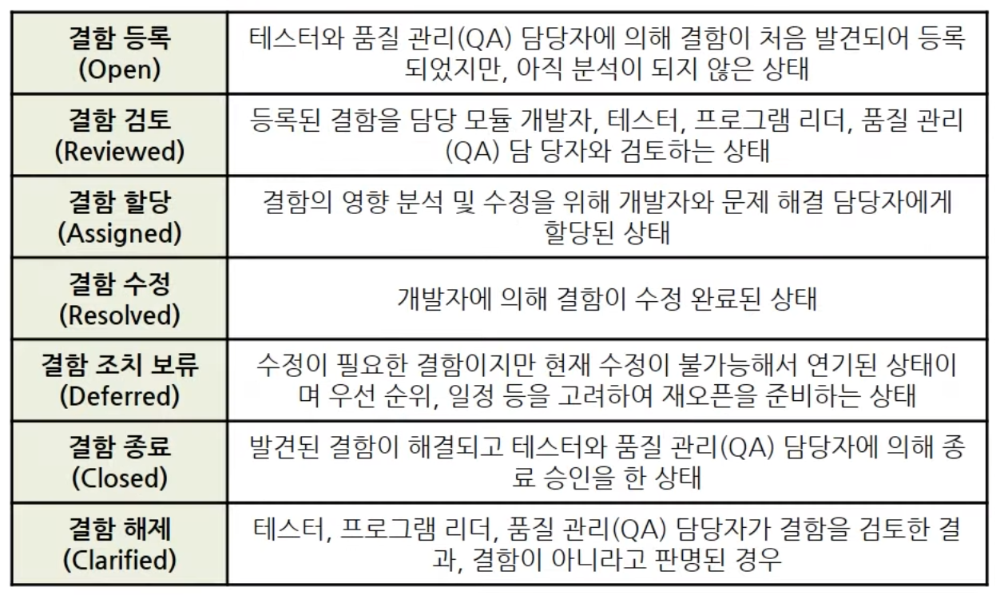
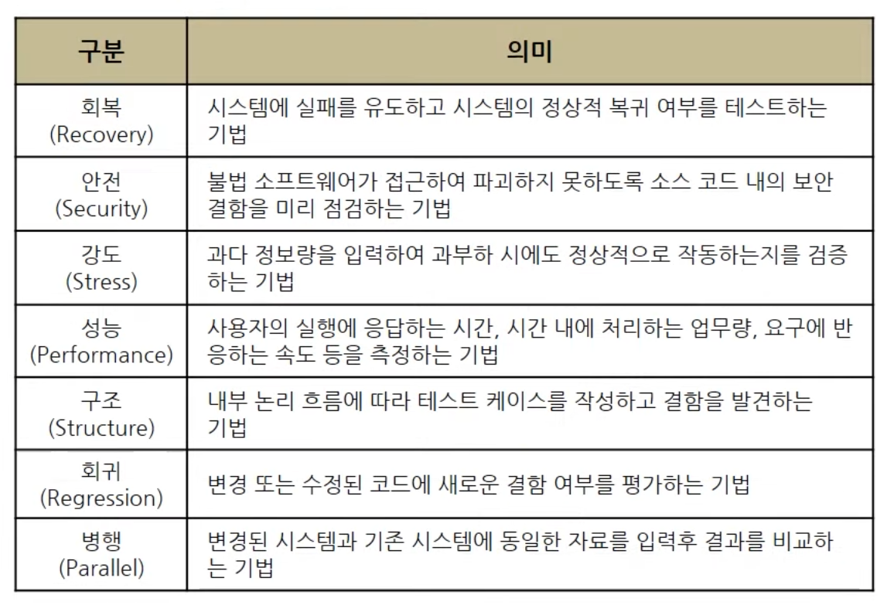
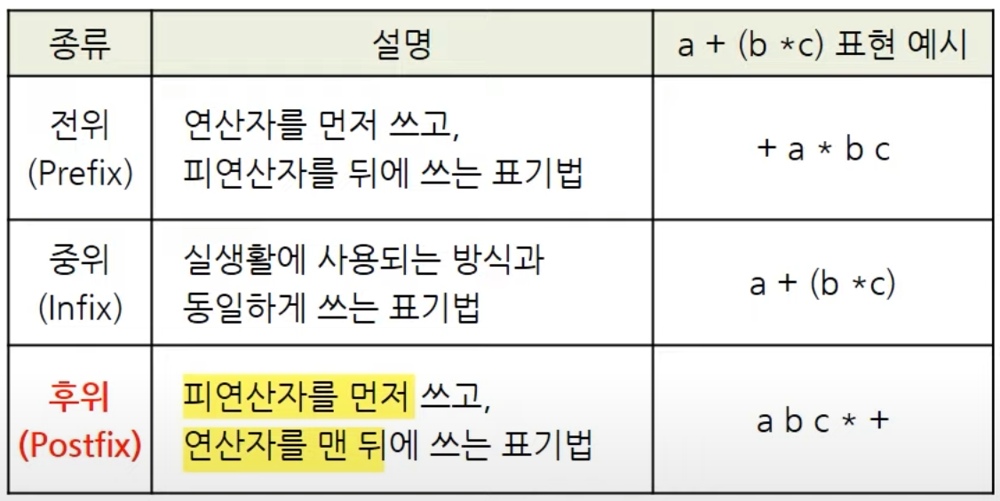

## 개요
- 정보처리기능사 실기 시험은 총 20문제로 구성되어있으며, 60점을 넘으면 합격
- 시험시간은 총 1시간 30분
- 각 과목의 문제들이 5문제 안팎으로 균형있게 출제됨

## 과목
- 응용 SW 기초 기술 활용 (운영체제, 데이터베이스, 네트워크)
- 프로그래밍 언어 활용 (C, JAVA, Python)
- 애플리케이션 테스트 수행
- SQL 활용

<br>
<hr>
<br>

<!-- TOC -->

- [■ 응용SW 기초 기술 활용](#%E2%96%A0-%EC%9D%91%EC%9A%A9sw-%EA%B8%B0%EC%B4%88-%EA%B8%B0%EC%88%A0-%ED%99%9C%EC%9A%A9)
    - [□ 운영체제](#%E2%96%A1-%EC%9A%B4%EC%98%81%EC%B2%B4%EC%A0%9C)
        - [윈도우 단축키](#%EC%9C%88%EB%8F%84%EC%9A%B0-%EB%8B%A8%EC%B6%95%ED%82%A4)
        - [윈도우 CLI 기본 명령어 DOS 명령어](#%EC%9C%88%EB%8F%84%EC%9A%B0-cli-%EA%B8%B0%EB%B3%B8-%EB%AA%85%EB%A0%B9%EC%96%B4-dos-%EB%AA%85%EB%A0%B9%EC%96%B4)
        - [UNIX 주요 명령어LINUX 명령어](#unix-%EC%A3%BC%EC%9A%94-%EB%AA%85%EB%A0%B9%EC%96%B4linux-%EB%AA%85%EB%A0%B9%EC%96%B4)
    - [□ 데이터베이스 개념](#%E2%96%A1-%EB%8D%B0%EC%9D%B4%ED%84%B0%EB%B2%A0%EC%9D%B4%EC%8A%A4-%EA%B0%9C%EB%85%90)
    - [□ 네트워크 개념](#%E2%96%A1-%EB%84%A4%ED%8A%B8%EC%9B%8C%ED%81%AC-%EA%B0%9C%EB%85%90)
        - [네트워크 지식](#%EB%84%A4%ED%8A%B8%EC%9B%8C%ED%81%AC-%EC%A7%80%EC%8B%9D)
        - [네트워크 클래스](#%EB%84%A4%ED%8A%B8%EC%9B%8C%ED%81%AC-%ED%81%B4%EB%9E%98%EC%8A%A4)
        - [**OSI 7계층**](#osi-7%EA%B3%84%EC%B8%B5)
        - [라우팅 프로토콜](#%EB%9D%BC%EC%9A%B0%ED%8C%85-%ED%94%84%EB%A1%9C%ED%86%A0%EC%BD%9C)
        - [네트워크 단말 장치](#%EB%84%A4%ED%8A%B8%EC%9B%8C%ED%81%AC-%EB%8B%A8%EB%A7%90-%EC%9E%A5%EC%B9%98)
- [■ 프로그래밍 언어 활용](#%E2%96%A0-%ED%94%84%EB%A1%9C%EA%B7%B8%EB%9E%98%EB%B0%8D-%EC%96%B8%EC%96%B4-%ED%99%9C%EC%9A%A9)
    - [□ C](#%E2%96%A1-c)
    - [□ JAVA](#%E2%96%A1-java)
        - [자바의 접근제어자](#%EC%9E%90%EB%B0%94%EC%9D%98-%EC%A0%91%EA%B7%BC%EC%A0%9C%EC%96%B4%EC%9E%90)
        - [자바로 코딩한 약수를 구하는 프로그램](#%EC%9E%90%EB%B0%94%EB%A1%9C-%EC%BD%94%EB%94%A9%ED%95%9C-%EC%95%BD%EC%88%98%EB%A5%BC-%EA%B5%AC%ED%95%98%EB%8A%94-%ED%94%84%EB%A1%9C%EA%B7%B8%EB%9E%A8)
    - [□ Python](#%E2%96%A1-python)
- [■ 애플리케이션 테스트 수행](#%E2%96%A0-%EC%95%A0%ED%94%8C%EB%A6%AC%EC%BC%80%EC%9D%B4%EC%85%98-%ED%85%8C%EC%8A%A4%ED%8A%B8-%EC%88%98%ED%96%89)
    - [□ 애플리케이션 테스트](#%E2%96%A1-%EC%95%A0%ED%94%8C%EB%A6%AC%EC%BC%80%EC%9D%B4%EC%85%98-%ED%85%8C%EC%8A%A4%ED%8A%B8)
        - [결함 관리 과정](#%EA%B2%B0%ED%95%A8-%EA%B4%80%EB%A6%AC-%EA%B3%BC%EC%A0%95)
    - [□ 애플리케이션 테스트의 기본 원리](#%E2%96%A1-%EC%95%A0%ED%94%8C%EB%A6%AC%EC%BC%80%EC%9D%B4%EC%85%98-%ED%85%8C%EC%8A%A4%ED%8A%B8%EC%9D%98-%EA%B8%B0%EB%B3%B8-%EC%9B%90%EB%A6%AC)
        - [형상관리 도구](#%ED%98%95%EC%83%81%EA%B4%80%EB%A6%AC-%EB%8F%84%EA%B5%AC)
    - [□ 테스트의 종류](#%E2%96%A1-%ED%85%8C%EC%8A%A4%ED%8A%B8%EC%9D%98-%EC%A2%85%EB%A5%98)
        - [테스트 분류 3가지](#%ED%85%8C%EC%8A%A4%ED%8A%B8-%EB%B6%84%EB%A5%98-3%EA%B0%80%EC%A7%80)
        - [화이트박스 테스트](#%ED%99%94%EC%9D%B4%ED%8A%B8%EB%B0%95%EC%8A%A4-%ED%85%8C%EC%8A%A4%ED%8A%B8)
        - [블랙박스 테스트](#%EB%B8%94%EB%9E%99%EB%B0%95%EC%8A%A4-%ED%85%8C%EC%8A%A4%ED%8A%B8)
    - [□ 애플리케이션 테스트의 유형](#%E2%96%A1-%EC%95%A0%ED%94%8C%EB%A6%AC%EC%BC%80%EC%9D%B4%EC%85%98-%ED%85%8C%EC%8A%A4%ED%8A%B8%EC%9D%98-%EC%9C%A0%ED%98%95)
        - [전위 / 중위 / 후위 연산](#%EC%A0%84%EC%9C%84--%EC%A4%91%EC%9C%84--%ED%9B%84%EC%9C%84-%EC%97%B0%EC%82%B0)
- [■ SQL 활용](#%E2%96%A0-sql-%ED%99%9C%EC%9A%A9)
    - [□ SQL 정의](#%E2%96%A1-sql-%EC%A0%95%EC%9D%98)
    - [□ SQL 명령어 분류](#%E2%96%A1-sql-%EB%AA%85%EB%A0%B9%EC%96%B4-%EB%B6%84%EB%A5%98)
        - [데이터 정의어DDL](#%EB%8D%B0%EC%9D%B4%ED%84%B0-%EC%A0%95%EC%9D%98%EC%96%B4ddl)
        - [데이터 조작어DML](#%EB%8D%B0%EC%9D%B4%ED%84%B0-%EC%A1%B0%EC%9E%91%EC%96%B4dml)
        - [데이터 제어어DCL](#%EB%8D%B0%EC%9D%B4%ED%84%B0-%EC%A0%9C%EC%96%B4%EC%96%B4dcl)
        - [집합](#%EC%A7%91%ED%95%A9)
    - [□ CREATE TABLE](#%E2%96%A1-create-table)
    - [□ SELECT](#%E2%96%A1-select)
        - [기본형](#%EA%B8%B0%EB%B3%B8%ED%98%95)
        - [LIKE](#like)
    - [□ 뷰](#%E2%96%A1-%EB%B7%B0)
    - [□ 인덱스](#%E2%96%A1-%EC%9D%B8%EB%8D%B1%EC%8A%A4)

<!-- /TOC -->

<br>

# ■ 응용SW 기초 기술 활용

## □ 운영체제

- 운영체제의 정의
    - 시스템의 하드웨어 / 소프트웨어 자원을 효과적으로 관리운영, 사용자가 시스템을 편하게 이용하도록 만들어둔 시스템 소프트웨어
    - UI, 데이터 입출력, 파일 관리, 하드웨어 자원 관리, 프로그램 제어 수행
- **처리능력 향상**
- **응답시간 단축**
- **사용가능도 증대**
- **신뢰도 향상**
- 처리방식 발전 과정
    - 배치(일괄) → 실시간 → 다중프로그래밍 → 시분할 → 다중처리 → 범용 → 분산처리

- 운영체제 : 하드웨어와 사용자 사이에 존재
- BIOS : 소프트웨어지만 하드웨어에 위치, 자원을 이용하도록 도와주며 RAM에 저장되어있음
- CMOS : CPU나 HDD 장치 연결 상태를 BIOS에 저장할 수 있음. RAM에 저장되어있음

- 윈도우 10 홈, PRO의 차이
    - 홈 : 일반 가정에서 사용할 수 있는 가벼운 제품
    - PRO : 홈 + 성능 향상과 보안 기능 추가
        - PRO에만 있는 BitLocker 장치 암호화 : 시스템 드라이브 및 USB 이동저장장치에 암호 설정 가능. 암호화 + 외장하드 분실 및 도난 시에도 데이터 손실 최소화
        - Windows Information Protection : 작업환경에 변화 없이 데이터 유출을 막는 기술. 승인이 되지 않은 프로그램이 데이터에 접근하는 것을 차단
        - 홈의 경우엔 CPU 소켓 1개 지원, 내가 원격제어 불가능, RAM 128GB까지만 지원
        - 프로의 경우엔 CPU 소켓 2개, 원격 지원 및 제어 가능, RAM 2TB까지 인식
- 윈도우의 경우, PNP (플러그 앤 플레이) 지원
    - 핫 스왑 : 전원 켜진 상태에서 외부장치 연결 및 제거하는 기능 (전원O)
    - 핫 플러그 : 새로운 장치 연결 시 시스템 전원이 꺼진 상태에서 사용 (전원X)
- FAT12, FAT16, FAT32 파일 시스템 : 연결리스트 형태의 자료구조 / 긴 검색 시간
- NTFS 파일 시스템 : FAT과 HPFS의 단점 개선

- 유닉스 : 다중 사용자, 시분할, 쉘, 커널, CUI
    - 리눅스는 오픈소스 운영체제
- i-node : 자료구조로서, 정규 파일, 디렉터리 등 파일 시스템 관한 정보 보유, 소유자, 허가내용, 파일 등이 변경될 때 같이 변경되는 파일 시스템 및 블록의 종류. 삭제라는 개념이 없음
    - 심볼릭 / 소프트 링크 : 바로가기 (바로가기)
- 하드 링크 : 원본과 동기화된 바로가기 (실시간 복제품)
- UFS 파일 시스템
    - EXT2 : UFS에서 불필요한 구조 제거한 파일 시스템
    - EXT3 : EXT2에서 저널링 기능을 추가
- 프로세스 스케줄링 : 자원들의 우선순위를 관리
    - 선점형 : RR, SRT, 다단계 큐
    - 비선점형 : FIFO, SJF, HRN, 우선순위

- 가상화 : 단일 호스트에서 다수의 서로 다른 운영체제를 구동 지원하는 기능
    - 플랫폼 가상화 : **하드웨어** 플랫폼 위에서 실행되는 호스트 프로그램
    - 리소스 가상화 : **메모리, 저장장치, 네트워크** 등을 결합하고 나누는 것
- 하이퍼바이저 : 단일 호스트에서 다수의 운영체제 가상 구동 지원 플랫폼, VMware
- 스풀링 : 프린터에서 쓰는 CPU와 입출력 장치간의 속도 차이 완화 시스템

### 윈도우 단축키



- 모두 Win 키를 누른 채로 같이 누른다
- D : 바탕화면 표시
- M : 열려있는 창 최소화 (미니멀)
- E : 탐색기 (익스플로러)
- R : 실행창
- F : 찾기 (파인드)
- X : 윈도우 시스템 관리
- I : 윈도우 설정, 제어판 (인포메이션)
- L : 사용자 전환, 잠금 (로그 아웃)
- P : 프로젝트, PPT 창 실행
- Pause : 시스템 구성 요소 확인
- Tab : 테스크바 실행
- Shift + S : 캡쳐도구

- Win + Ctrl + D : 가상 데스크탑 만들기
- Win + Ctrl + F4 : 가상 데스크탑 종료
- CTRL + W : 열러있는 윈도우 창 종료, 탭을 우선적으로 하나씩 종료
- ALT + F4 : 열려있는 창 전체를 닫는 단축키

### 윈도우 CLI 기본 명령어 (DOS 명령어)

- COPY : 파일 복사
- DEL : 파일 삭제
- DIR : 파일 목록 확인, 하위 디렉터리 목록 확인
- XCOPY : 구조 복사 (외부 명령어)
- REN : 파일 이름 변경, 파일 이동 (RENAME)
- TYPE : 텍스트 파일의 내용을 화면에 표시
- ATTRIB : 파일 속성 변경, CHMOD와 동일
- MOVE : 파일, 디렉토리 변경 및 이동
- FIND : 파일에서 특정 텍스트 문자열 검색
- FINDSTR : 파일에서 특정 문자열을 찾음
- REPLACE : 파일을 대체
- MD : 디렉토리 생성
- CD : 디렉토리 경로 변경
- RD : 디렉토리 삭제
- CLS : 화면의 내용을 지움
- DATE : 현재 날짜와 시간을 표시
- FORMAT : 디스크 포맷
- CHKDISK : 디스크 상태 점검 및 손상부분 복구
- EXIT : 프로그램 종료

- regedit : 레지스트리 편집기

### UNIX 주요 명령어(LINUX 명령어)

- chmod : 파일 사용허가 모드 변경
- ls(파일 목록), cp(파일 복사), mv(파일 이동, 이름 변경), rm(파일 삭제), cat(파일 내용 표시)
- cd(디렉토리 경로 변경), mkdir, rmdir(디렉토리 생성 삭제), pwd(현재 디렉토리 경로)
- date : 날짜를 보여주거나 설정
- passwd : 로그인할 때 사용자 각각의 비밀번호 설정 및 변경
- who : 현재 시스템에 접속한 사용자 표시
- ping : 네트워크상의 다른 컴퓨터들과 연결상태 점검
- shutdown : 작업중인 상태를 체계적으로 종료
- kill : 프로세스 강제 종료, 특정 PID 프로세스 선택해 종료
- exit : 프로그램 종료
- close : 파일 닫기
- ps : 프로세스 상태 보기
- finger : 현재 시스템에 접속된 사용자 정보 조회
- chown : 파일의 소유권 변경
- sleep : 프로세스 수행을 일시 중지
- read : 파일 내용을 순차적으로 읽기
- write : 파일 내용을 순차적으로 쓰기
- ifconfig : 네트워크 인터페이스를 설정하거나 확인

## □ 데이터베이스 개념

- **DBMS** : 데이터베이스 관리 시스템
    - 자료처리(파일처리) 시스템의 문제점인 자료의 조옥성과 중복성을  해결하기 위한 소프트웨어 시스템 → **데이터의 논리적, 물리적 독립성**을 유지
    - 모든 응용 프로그램들이 데이터베이스를 공용할 수 있도록 관리해준다.
    - 데이터베이스와 사용자간의 인터페이스 역할로써 사용자가 요구하는 자료가 타당한지 검사 후 데이터베이스에서 검색하여 사용자에게 결과를 제공한다.
    - 필수 기능
        - **정의** → 데이터베이스에 저장될 데이터의 타입과 구조에 대한 정의와 데이터 이용방식 정의
        - **조작** → 데이터 조작이 가능하도록 하는 기능. 즉, **삽입, 삭제, 갱신, 조회**
        - **제어** → 여러 사용자로부터 데이터 무결성과 보안을 유지하기 위한 기능으로서 권한검사, 병행제어 작업 등을 수행
    - Oracle DB : 리눅스 서버에서 자주 이용, 높은 예산과 복잡한 비즈니스 고객을 위함
    - MySQL : 리눅스 서버에서 자주 이용, 낮은 구매 비용 및 무료 GUI, 사용하기 쉽고 단순
- DBA : 데이터베이스  관리자 (사람이긴 하나 DBA가 답인 문제는 기계인것처럼 설명)
    - 데이터베이스 시스템의 전체적인 관리 및 운영을 책임지는 사람이나 그룹 의미
    - 데이터의 저장 구조와 접근방법 결정
    - 시스템 보안과 무결성을 책임지며, 스키마를 정의
    - 데이터 사전을 구성하고 유지 및 관리
    - DBMS를 사용
- 데이터베이스 : 자료(data)의 모임
    - 데이터베이스의 특징
        - 실시간 접근성
        - 지속적인 변화
        - 동시 공유
        - 상호 참조
        - 데이터 논리적 독립성
    - 데이터베이스 설계
        - 요구조건 분석
        - 개념적 설계 → 논리적 설계 → 물리적 설계
        - 구현
- 스키마 : 데이터베이스의 전반적인 명세
    - 외부 스키마 : 개인의 관점 (서브스키마)
    - 개념 스키마 : 조직적 관점 (논리스키마)
    - 내부 스키마 : 시스템 프로그래머의 관점
- 관계 데이터베이스 구조
    - 릴레이션 : 2차원 테이블 형태로 구성된 테이블. 릴레이션 스키마와 릴레이션 값으로 이루어져있음. 행과 열로 구성되어있음
    - 각 컬럼의 주제, 이름 : 릴레이션 스키마
    - 각 컬럼 안에 있는 내용물 : 릴레이션 인스턴스(값)
    - 열의 이름은 애트리뷰트(속성)이라고 하며, 하나의 도메인과 연결 (**열 = 애트리뷰트 = 속성**)
        - 도메인 : 애트리뷰트에서 표현가능한 값의 범위. 속성의 데이터 타입과 크기, 제약조건 등의 정보
    - 한 릴레이션에서 애트리뷰트의 이름은 모두 다르다.
    - 행의 이름은 튜플(tuple), 하나의 레코드를 의미 (**행 = 레코드 = 튜플**)
    - 열, 애트리뷰트의 수를 해당 릴레이션의 차수, Degree라고 함.
    - 행, 튜플의 수를 해당 릴레이션의 기수, Cardinality라고 함.
- 트랜잭션 : 하나의  작업 수행을 위한 연산들의 집합
    - ACID : 원자성, 일관성, 독립성, 지속성
        - 원자성(Atomicity) : 트랜잭션이 부분실행, 중단되지 않음
        - 일관성(Consistency) : 자료형이 모두 일관적으로 저장되어있음
        - 독립성(Isolation) : 다른 트랜잭션이 끼어들지 못함
        - 지속성(Dulability) : 수행된 트랜잭션은 영구히 반
- **키(Key)**
    - 테이블에서 다른 데이터와 구분하기 위한 유일한 값을 가지는 필드 또는 필드의 집합
    - 각 튜플을 식별할 유일한 성격을 갖는 것으로, 테이블에서 적어도 한 개는 존재해야 한다
    - **슈퍼키** : 한 릴레이션 내에 있는 속성들의 집합으로 구성된 키. **유일성**은 만족하지만 **최소성은 만족하지 않음**
    - **후보키** : 한 테이블에서 **유일성과 최소성을 만족**하는 키
    - **기본키** : 후보키들 중 **NULL이 될 수 없으며, 중복 불가능**.
    - **외래키** : 다른 릴레이션의 기본키를 가져와서 **참조**하는 키
    - **대체키** : 후보키들 중 **기본키를 제외**한 나머지 후보키들
- 데이터베이스 이상현상 아노말리 (Anomaly)
    - 데이터 불일치 현상
    - 삽입이상 / 삭제이상 / 갱신이상
- 관계 대수 : 정보 유도 절차적 언어
- 관계 해석 : 정보 명시 비절차적 언어
- 무결성
    - 개체 무결성 : 기본키 제약, 테이블은 기본키를 지정하고 그 원칙을 지켜야함
    - 참조 무결성 : 외래키 제약, 외래키는 기본키여야 하며 참조할 수 없는 값은 지닐 수 없음
    - 도메인 무결성 : null값 허용인지, 필드의 알맞는 타입이 아닌 값은 지닐 수 없음
- ERD
    - 사각형 : 개체, 엔티티
    - 타원형 : 속성, 애트리뷰트
    - 마름모 : 관계
    - 이중 사각형 : 약 엔티티

## □ 네트워크 개념

- IP 주소
    - 컴퓨터 네트워크에서 장치들이 서로를 인식하고 통신을 하기 위해서 사용하는 특수한 번호
    - 특정 개체에 이름을 선언하여 구분하는 데 사용한다
- IPv6
    - 기존엔 32비트의 IPv4를 썼는데, IP주소가 부족해져서 4배 확장한 128비트 체계의 차세대 주소체계
        - IPv4는 32bit, IPv6는 128bit
        - IPv4는 옥텟(.) IPv6는 콜론(:)
    - 16진수로 표기하며, 4개의 16진수를 콜론(:)으로 구분
        - IPv4 : 192.168.43.1
        - IPv6 : 52AD:31DE:1AFD:59CR::1
    - IPv4에서는 옵션 필드의 구성이 제한적인데 비해 IPv6에서는 확장헤더를 이용하여 다양하고 안정된 옵션을 사용할 수 있음
    - 라우터의 부담을 줄이고, 네트워크 부하를 분산시킴
    - 보안, 인증, 라벨링, 데이터 무결성, 데이터 비밀성 제공
    - 특정 흐름의 패킷들을 인식하고, 확장된 헤더에 선택사항들을 기술할 수 있음
    - IPv4의 종류 : 유니캐스트, 브로드캐스트, 멀티캐스트
    - IPv6의 종류 : 유니캐스트, 애니캐스트, 멀티캐스트

- 노드 : 단말 접합점 (단말을 이어주는 분기와의 접합점)
- 애드훅 네트워크(Adhoc Network) : 자율 구조 네트워크 (노드에 의해 자율적으로 구성된 기반 구조 없는 네트워크)

- SOAP : 서로 다른 기기 간 정보통신
    - HTTP, HTTPS, SMTP등을 통해 규격화 및 표준화하여 모든 기종에서 호환성을 제공
    - XML을 이용하여 이기종 간에 정보 교환에 사용되는 프로토콜
- VLAN : 브릿지를 이용한 복수 논리적 네트워크
    - 하나의 브릿지를 통해 복수의 논리적 네트워크를 구성.
    - 관리하고 구성에 유연하지만 나누어진 정보를 서로 전달 X, 하나의 물리적 장애 발생 시 다른 네트워크에 영향을 줌
- 디스패치 : 준비에서 실행으로 프로세스 상태 전이
- IoT : 인터넷을 포함한 사물

### 네트워크 지식

- XML : SGML의 장점을 수용한 높은 호환성의 HTML 확장 언어
- JSON : XML의 단점 보완, Javascript 기반의 독립형 언어. 인간이 읽을 수 있는 데이터 교환용으로 설계된 경량 테스트 기반의 개방형 표준 포맷
- AJAX : 비동기식 자바스크립트와 XML의 약자
    - 브라우저의 XMLHttpRequest 객체를 사용, 일부 페이지의 갱신이 필요한 데이터만 수정

- HTML : 대표적인 마크업 언어, 하이퍼 텍스트 문서를 만들기 위해 사용
- DHTML : 동적 웹페이지 설정 가능
- HTML5 : 이전 버전들의 단점 보완, 불필요한 기능 삭제, XHTML에 있던 XML문법 모두 삭제

- 터미널(단말기) : 디스플레이에 데이터 등의 입출력 등의 기능을 수행하는 장치
- 종단장치 : OSI 7계층 모두 구현, 네트워크의 가장 처음과 마지막 종단에 해당하는 장치
- 중간장치 : OSI 7계층 중 하위 3계층만의 기능을 수행

- MA (멀티 엑세스 네트워크) : 하나의 인터페이스를 통해 다수의 장비와 연결
- BMA (브로드캐스트) : 하나의 데이터 패킷 전송하면 동일 네트워크의 모든 장비에 전송
- NBMA (논-브로드캐스트) : 브로드캐스트가 없는 다중 접속 환경으로서 가상회선 사용

- TKIP : 임시키 무결성 프로토콜
    - 무선 네트워킹 표준 보안 프로토콜로 WEP의 취약점으로 인한 대안
    - IEEE 802.11 프로토콜의 일부
- xUnit : 다양한 코드 중심의 테스트 프레임워크
    - JUnit : JAVA 단위
    - CppUnit : C++ 단위
    - NUnit : .NET 단위

### 네트워크 클래스

- IPv4 주소 부족으로 인해 사용 목적에 따라 IP의 대역대를 나누고 네트워크 주소와 호스트 주소를 분류하여 관리를 용이하게 한 것
- A 클래스 : 대륙
    - **0.0.0.0 ~ 127**.255.255.255
    - 서브넷 마스크 255.0.0.0
- B 클래스 : 국가
    - 128.0.0.0 ~
    - 서브넷 마스크 255.255.0.0
- C 클래스 : 기업
    - 192.0.0.0 ~
    - 서브넷 마스크 255.255.255.0
- D 클래스 : 조직, 그룹
    - 224.0.0.0 ~
- E 클래스 : 연구용
    - 240.0.0.0 ~

### **OSI 7계층**



- 서로 다른 시스템 간의 원활한 네트워크를 위해 1977년 ISO에서 제안한 통신 규약
- 7개의 계층을 두어 시스템의 복잡도를 최소화함
- 인접한 상 하위 계층 간에는 인터페이스를 둔다
- 7계층 : 응용계층
    - 사용차가 네트워크에 접근할 수 있도록 **인터페이스와 서비스** 제공
    - 프로토콜 : **HTTP(웹 데이터 전송 프로토콜), FTP(파일 전송 프로토콜), DNS, SSH, TELNET**
        - HTTP : www상에서 서버와 클라이언트 간의 데이터 전송
        - FTP : 서버와 클라이언트 간의 파일 전송, 해당 서버에 접속하려면 계정과 암호 필요 (포트번호 20번과 21번)
        - DNS : 도메인 네임 시스템 (인터넷 주소를 네트워크 주소로 변환하거나 그 반대)
        - SSH : 원격 통신에 사용되며, 암호화 기법 사용 (포트번호 22)
        - TELNET : 원격 통신에 사용되며, 암호화 작업이 없음 (포트번호 23)
    - 데이터 단위 : 메시지
- 6계층 : 표현계층
    - 세션계층에서 받은 데이터를 **암호화, 압축, 코드 변환, 구문 검색** 기능 제공
    - 프로토콜 : JPG, MPEG, AFP, SSL
    - 데이터 단위 : 메시지
- 5계층 : 세션계층
    - 송수신 관련성 유지, 대화 제어, 동기 제어, 동기점(오류있는 데이터 회복), 프로그램간의 접속을 연결, 유지, 종료 시켜주는 역할 수행
    - 프로토콜 : **NetBIOS, SOCKETS, SSH**
    - 데이터 단위 : 메시지
- 4계층 : 전송계층
    - 시스템 종단간 오류 수정, 흐름 제어 수행, 신뢰성있는 데이터 전송 역할 수행, 전송연결 설정
    - 네트워크 상에서 단대단(end to end) 형태로 전송 흐름 제어 및 오류 제어
    - 전송 데이터의 **다중화, 집중화, 주소지정, 에러제어, 흐름제어**
    - 프로토콜 : **TCP, UDP**
        - TCP : 처음부터 **네트워크가 상호 연결중**, 데이터 송수신마다 에러 체크, 데이터 검수 전공 프로토콜
        - UDP : 네트워크 **연결 안하고 있다가** 데이터가 들어오면 가장 빠른 루트로 **연결** (스트리밍), 데이터 비검수 전송 프로토콜
    - 데이터 단위 : TCP는 세그먼트, UDP는 데이터그램
- 3계층 : 네트워크계층
    - 패킷(데이터를 작은 단위로 분할한 것)을 목적지까지 전달하는 역할, 논리적 주소 사용
    - **패킷 정보 전송, 교환 기능, 경로 선택(IP)**, 트래픽 제어
    - 프로토콜 : **IP, RIP, ARP, ICMP, X.25**
        - ARP : 논리주소(IP)로 물리주소(MAC) 검색
        - RARP : 물리주소(MAC)로 논리주소(IP) 검색
    - 데이터 단위 : 패킷
- 2계층 : 데이터링크계층
    - 오류 제거 및 흐름 제거, 신뢰성 있는 데이터를 전달할 수 있도록 함
    - **데이터 전송, 오류제어, 흐름제어, 프레임 동기 링크 효율을 향상, MAC 물리적 주소 관리**
    - 노드 - 노드 사이의 데이터 전송, 물리 계층을 정상적으로 인식할 수 있게 도와줌
    - 표준 프로토콜 : **HDLC, LAPB, PAPD, PPP, 이더넷**
    - 데이터 단위 : 프레임
- 1계층 : 물리계층
    - 물리적 매체를 통한 전송
    - **전기적, 기계적, 기능적, 절차적 특성, 물리적 특징**
    - 표준 프로토콜 : **RS-232C, X.21, RS-449, Coax, ATM**
        - ATM : 비동기식 전송 모드, 데이터를 일정한 크기로 나누어 별도 동기 신호 없이 패킷 전송. 계속적으로 동기화 안 이루어 사용하지 않는 슬롯은 반납하여 효율 높임. 첫 데이터를 보내 연결 후 실질적인 데이터를 전송
        - 반대로 동기식 전송 모드는 STM이며, 전송속도가 일정하고 신호가 동일해야 하며 계속 시간 슬롯을 할당하기 때문에 회선 사용 효율 떨어짐.
    - 데이터 단위 : 비트

- TCP/IP 4계층
    - 응용계층 / 전송계층 / 인터넷계층 / 네트워크계층
    - 각각 OSI의 765 / 4 / 3 / 21 계층과 동기화



### 라우팅 프로토콜

- 프로토콜의 기본 요소
    - 구문(신텍스) : 데이터 형식 규정
    - 의미(시멘틱) : 오류 제어 정보 규정
    - 시간(타이밍) : 속도 조정 규정
- RIP : 홉 카운트를 메트릭으로 설정해 이용하여 최적의 경로를 설정하는 소규모용 프로토콜
    - UDP/IP 상에서 동작하는 라우팅 프로토콜이며, Hop Count는 15개, 16개 이상은 불가능
    - 포트번호 520
    - 기업의 근거리용, 소규모 네트워크 통신망
- OSPF : RIP 단점 개선, 링크상태 알고리즘 기반으로 최단경로를 찾는 프로토콜
- BGP : 규모가 큰 네트워크의 상호연결을 위해 사용하는 프로토콜
- IGRP : RIP와 동일한 거리벡터 기반의 내부용 프로토콜
- DHCP : 각종 프로토콜 및 IP주소 등 기본 설정을 클라이언트에게 자동으로 제공해주는 프로토콜 (유동IP 생성)
- SNMP : 네트워크 장치로부터 장보를 자동으로 수집 및 관리, 실시간 네트워크 장비 모니터링 및 데이터 변경, 높은 편리성 대신 외부 접속에 대한 취약점 등이 존재

### 네트워크 단말 장치

- 허브 : 대역폭 분배 장치, 네트워크 망의 물리적인 길이 확장 (물리 계층)
- 리피터 : 신호 증폭 (물리 계층)
- 라우터 : 최적의 경로 제공, 서로 다른 구조와 망의 통신을 위해 사용, LAN MAN WAN 연결 (네트워크 계층)
- 브릿지 : 같은 구조의 네트워크 연결, 패킷이 목적지로 전송하도록 도와주게 하며 여러 LAN을 연결. 소프트웨어적 방법을 통해 프레임을 목적지까지 1대1로 연결 전송 (데이터링크 계층)
- 스위치 : 여러개의 포트를 가진 고성능 브릿지. 기본 기능은 허브와 동일하지만 전이중 통신방식으로 속도가 더 빠름. 패킷의 목적지의 지정된 포트로 직접 전송
- 게이트웨이 : 다른 구조의 네트워크 연결 (세션계층)

- NAS : 네트워크 결합 스토리지로, 네트워크로 연결하는 하드디스크이자 저장장치
    - 반대의 개념은 직접 결합하여 사용하는 DAS
- 클라우드 컴퓨팅 : 인터넷을 이용해 가상화된 컴퓨터의 시스템 리소스를 요구하여 즉시 제공받는 것

# ■ 프로그래밍 언어 활용

## □ C

```c
#include <stdio.h> // 헤더파일 호출

void main(void) { // 함수 정의
	printf("Hello World!\n"); // 명령어
	return 0; // 함수 리턴
}
```

- 알고리즘(의사 코드 혹은 순서도)을 주고, C언어로 프로그램을 작성하는 문제가 기출
- 변환명세
    - %d : 10진수 정수형
    - %o : 8진수 정수형
    - %x : 16진수 정수형
    - %n.mf : 앞 n, 소수부 m 만큼의 실수형
    - %c : 문자형
    - %s : 문자열형
- 비트 연산자 & 혹은 |
    - 10진수 값을 2진수로 변환시킨 후 각 자리마다 and 혹은 or 연산
- 삼항연산자 조건 ? True : False
- 시프트 연산자 << >>
    - 2진수로 변환 후 시프트연산자 뒤의 숫자만큼 비트를 이동시킴
- 진수 표현
    - 2진수 : **0b**1001
    - 8진수 : **0**67
    - 16진수 : **0x**A2

## □ JAVA

```java
public class Main {
	public static void main(String[] args) {
		System.out.println("Hello World!");
	}
}
```

- 객체지향 언어로, 여러 클래스들로 이루어진 프로그램

### 자바의 접근제어자

- private : 클래스 내부에서만 접근을 허용
- default : 따로 지정하지 않을 때 지정. 클래스 내부와 동일 패키지에서 접근을 허용
- protect : 클래스 내부와 동일 패키지, 상속받은 패키지에서만 접근을 허용
- public : 클래스 내부, 동일 패키지, 상속, 외부 모두 접근을 허용

### 자바로 코딩한 약수를 구하는 프로그램

```java
public class Aliquot {
	public static void main(String[] args) {
		int n = 10;
		int i = 1;

		while(i<=n){
			if(n%i == 0){
				System.out.println(i);
			}
			i++;
		}
	}
}
```

## □ Python

```python
print("Hello World!")
```

- 범용적으로 쓰이는 간결한 인터프리터 언어

# ■ 애플리케이션 테스트 수행

## □ 애플리케이션 테스트

- 애플리케이션에 잠재되어있는 결함을 찾아내는 **디버깅** 행위, 절차
- 개발된 소프트웨어가 **고객의 요구사항을 만족**시키는지 **확인**
- 소프트웨어가 예상대로 정해진 기능을 정확히 수행하는지 검증
- 테스트 실행 전 소프트웨어의 유형을 분류하고 중점적으로 테스트할 사항을 미리 정리해야 함
- 코드 인스펙션 프로세스의 순서
    - 범위계획 → 시작 → 준비 → 인스펙션 회의 → 재작업 → 후속처리
- V-모델 : 소프트웨어 개발 프로세스인 **폭포수 모델의 확장된 형태**
    - 요구사항분석 → 기능명세분석 → 설계 디자인 → 개발 (낮아짐)
    - 단위테스트 → 통합테스트 → 시스템테스트 → 인수테스트 (높아짐)
- 결함 : 프로그램과 명세서간의 차이, 업무 내용 불일치, 의도와 다른 동작 등
- 결함 심각도 : 결함이 전체 시스템에 미치는 영향의 척도
    - (High, Medium, Low)
- 결함 검사
    - Fixed : 결함 수정
    - Assigned : 결함 할당
    - Open : 결함 보고 (분석 전)
    - Closed : 수정 후 결함 미발견
    - Deferred : 수정 연기
    - Clarified : 비결함
- 결함 관리 프로세스 7과정
    - 관리계획 → 기록 → 검토 → 수정 → 재확인 → 상태추적 → 최종분석
- 에러 : 개발 중 발생한 부정확한 결과
- 오류 : 프로그램 버전간 차이로 발생
- 실패 : 프로그램 버전간 실행 결과 차이
- 휴먼에러 : 원인이 인간의 실수인 에러
- 코드 인스펙션 : 자동화 도구 사용, 결함 발견 / 수정, 품질 향상
- 정적 테스트
    - 인스펙션 : 동료 검토, 각자의 시점에서, 시간 오래걸림, 리뷰 계획 등 체계적임
    - 워크스루 : 비형식적, 돌아다니면서 지식 공유, 기술자들끼리 함, 미리 준비된 자료를 바탕으로 정해진 절차에 따라 검토하는 행위, 코드 품질 평가 및 개선을 목적으로 수행
- 테스트 케이스 : 요구사항 준수 여부 확인용 입력값 (예제 입력)
    - 입력, 실행 조건, 테스트 절차 및 특정 프로그램 경로를 실행하거나 검증하는 것과 같은 특정 소프트웨어 테스트를 목표로 실행될 단일 테스트를 정의하는 테스트 항목에 대한 명세서
    - 커버리지 : 테스트 품질 측정 기준, 테스트의 정확성과 신뢰성을 향상시키는 역할

- 정적 분석도구 : 실제 실행 없이 멈춰있는 소스코드 분석
- 동적 분석도구 : 소스코드는 분석 안하고, 프로그램 동작 및 반응 추적 및 보고 분석, 프로그램 모니터, 스냅샷

- 스텁 : 하위 모듈 테스트 진행
    - 상위 모듈은 있지만 하위 모듈이 없을 때 진행하는 하향식 테스트
- 드라이버 : 상위 모듈 테스트진행
    - 하위 모듈은 있지만 상위 모듈이 없을 때 진행하는 상향식 테스트

- 유스케이스 다이어그램 : 시스템 간 상호작용 표현
- 유스케이스 : 시스템 동작을 사용자 입장에서 표현, 모델링한 시나리오

- 테스트 오라클 : 사전 정의된 참 값을 대입 비교
    - 참 오라클 : 기대결과 생성 후 오류 검출 (전부 다 생성)
    - 샘플링 오라클 : 특정 입력 값이 기대 결과 제공 (일부만 생성)
    - 휴리스틱(추정) 오라클 : 확률 / 직관, 추정에 의한 예상 결과 (일부만 생성하고 남은건 추정)
    - 일관성 검사 오라클 : App. 변경 전후의 값 동일 여부 검증 (변경 후 다시 했을 때 동일한지)

- 소프트웨어 아키텍처 : 소프트웨어의 골격이 되는 기본 구조
    - 기본원리 : 모듈화 / 추상화 / 단계적 분해 / 정보은닉
- 시스템 아키텍처 : 시스템 구조 설계 방식

### 결함 관리 과정



## □ 애플리케이션 테스트의 기본 원리

- **결함집중** : 대다수의 결함들은 개발자나 애플리케이션 특성으로 인하여 특정 모듈에서 집중적으로 발생, **적은 수의 모듈에서 대다수 결함이 발견, 파레토 법칙(80/20)**
- **정황에 의존** : 소프트웨어 특징, 테스트 환경, 테스터 역량 등 정황에 따라 테스트를 다르게 진행
- **오류-부재의 궤변** : 소프트웨어가 사용자의 요구사항을 만족시키지 못하면 **오류가 없더라도 품질이 높다고 말할 수 없음**
- **살충제 패러독스** : 동일한 테스트 케이스로 **반복적으로 수행하면 새로운 결함을 찾을 수 없음**. 따라서, 테스트 케이스를 정기적으로 리뷰하거나 개선해야 할 필요가 있음
- **불완전** : 모든 가능성을 테스트하는 것은 불가능
- **결함 발견을 위한 활동** : 소프트웨어가 결함이 발견되지 않는다 해도 결함이 완전히 없다고 할 수는 없음

### 형상관리 도구

- CVS : 가장 오래된 형상관리 도구, 중앙 집중형 서버 저장소를 두고 클라이언트가 접속해 버전 관리
- SVN : CVS를 개선한 것으로 빠른 속도, 저장공간 절약, 작업 모음 단위 기반으로 동작 개선
- GIT : 중앙 집중혀여 방식이 아닌 분산형 방식. PC 스스로가 완전한 저장소 구성, 필요하면 중앙 집중형 방식으로도 운영 가능
    - 업로드 : 체크인
    - 다운로드 : 체크아웃
    - 반영 : 커밋

## □ 테스트의 종류



### 테스트 분류 3가지

- 명세기반 테스트 : 프로그램의 요구사항 명세서를 기반으로 테스트 케이스를 선정
- 구조기반 테스트 : 소프트웨어 내부 논리 흐름에 따라 테스트 케이스를 선정
    - 구조 기반 테스트 유형엔 **구결조 조변다**가 있음
- 경험기반 테스트 : 유사 소프트웨어나 기술 평가에서 테스터의 경험을 토대로 직관과 기술 능력을 기반으로 테스트 케이스 선정

### 화이트박스 테스트

- 내용이 투명하게 보이는 박스. 즉, 주변을 보지 않고 프로그램의 내부 구조만에 집중함. **개발자 입장**에서 명세 기반
- 설계된 절차에 초점을 맞춘 구조적 테스트로서, 프로세서 설계의 제어구조를 사용하여 검사 사례를 설계하며 테스트 과정의 초기에 적용한다.
- 각 조건에서의 참과 거짓의 모든 논리적 결정이 적어도 한 번 이상 수행된다.
- 프로그램에 제어구조에 따라 **선택, 반복** 등의 부분들을 수행함으로써, **논리적 경로**를 결정한다.
- 모듈 안의 **작동을 직접 관찰**할 수 있다.
- 원시 코드의 **모든 문장을 한 번 이상 수행**한다.
- 제품의 내부 요소들이 명세서에 따라 수행되고 충분히 실행되는가를 보장하기 위한 검사이다.
- 프로그램 원시 코드의 논리적인 구조를 커버하도록 테스트 케이스를 설계한다.
- 화이트박스의 종류 : **경로**검사, 제어**구조**검사, **조건**검사, **루프**검사, 데이터 **흐름**검사, **분기**검사

### 블랙박스 테스트

- 프로그램 내부의 로직은 전혀 상관 없고, 원하는걸 입력했을 때 원하는게 출력되는지에 모든 신경을 쓰는 검사. **사용자 입장**에서 검사
- 소프트웨어가 수행할 특정 기능을 알기 위해 각 기능이 완전히 작동되는 것을 입증하는 검사
- 부정확하거나 누락된 기능, 인터페이스 오류, 자료구조, 외부데이터 베이스 접근에 따른 오류, 행위나 성능의 오류,  초기화와 종료 오류 등을 발견하기 위해 사용 (테스트 후반부에 적용)
- **데이터 위주** 또는 **입출력 위주** 검사
- 각 산출물의 기능별로 적절하나 정보 영역을 정하여 적합한 입력에 대한 출력의 정확성을 점검
- 종류 : 동치(동등) **분할** 검사, **경계값**(한계값) 분석
- 원인 : 원인 효과 **그래프** 검사, **오류 예측** 검사, **비교** 검사

## □ 애플리케이션 테스트의 유형

- **단위 테스트 → 통합 테스트 → 시스템 테스트 → 인수 테스트(검증, 확인 테스트)**
    - 조그만한 단위별로 각각 테스트
    - 이후 조그만한 것들을 통합하여 크게 테스트
    - 해당 컴퓨터 시스템에서 제대로 수행되는지 전체적으로 테스트
    - 사용자의 요구사항을 만족시키는지 테스트

- 단위 테스트
    - 원시 프로그램 코드에 대한 분석을 진행
    - 코드가 효율적인지, 프로젝트 내에 합의된 코딩 표준을 준수하는지 검증
    - 인터페이스, 외부적 입출력, 자료 구조, 독립적 기초 경로, 오류 처리 경로, 경계 조건 테스트
    - 개발자가 직접 시행
- 통합 테스트
    - 프로그램 구성하는 각각의 모듈 통합, 통합된 컴포넌트 간의 인터페이스와 상호작용 상의 오류를 발견하는 작업
    - 개발자가 직접 시행
- 시스템 테스트
    - 해당 컴퓨터 시스템에서 제대로 수행되는지 전체적으로 테스트
- 인수 검사, 검증 검사, 확인 테스트
    - 사용자의 요구사항을 만족시키는지 테스트
    - 통합검사 후 전체내용이 하나의 소프트웨어로 통합 후 요구사항 명세서 토대로 진행
    - 개발한 소프트웨어를 사용자가 직접 테스트
    - 종류
        - 형상 검사 : 소프트웨어 구성 요소, 목록, 유지보수를 지원하기 위한 모든 사항이 제대로 표현되어있는가
        - 알파 검사 : 제한된 환경(개발자들이 있는 정해진 공간)에서 사용자가 개발자의 환경에서 프로그램을 실행 (개발자 컴퓨터로 테스트, 개발자도 지켜보는 중)
        - 베타 검사 : 제한되지 않은 환경(이젠 진짜 집에서)에서 사용자가 프로그램 실행 후 오류 발생 시 개발자에게 주기적으로 보고(게임 베타테스트가 이 의미)
        

### 전위 / 중위 / 후위 연산



# ■ SQL 활용

## □ SQL 정의

- 데이터베이스를 조작하여 원하는 자료를 추출하거나 필요한 데이터를 추가, 삭제, 수정하기 위한 비절차적 프로그래밍 언어
- 관계형 데이터베이스를 조작하는 프로그래밍 언어
- 관계 대수와 관계 해석을 기초로 한 혼합 데이터 언어
    - 관계 대수 : JOIN, SELECT같은 원하는 정보를 어떻게 유도할까 기술하는 절차적인 방법
    - 관계 해석 : 원하는 정보가 무엇이라는 것만 정의하는 비절차적인 방법

## □ SQL 명령어 분류

### 데이터 정의어(DDL)

- 스키마, 도메인, 테이블, 뷰, 인덱스를 정의하거나 변경 / 제거할 때 사용
- CREATE TABLE : 테이블 생성
    - UNIQUE : 크리에이트에서 쓰는 노중복
- ALTER TABLE : 테이블 수정
    - ADD 컬럼명 데이터타입 : ALTER문의 열 추가
    - MODIFY 컬럼명 데이터타입 : ALTER문의 타입 변경
    - DROP 컬럼명 : ALTER문의 열 삭제
    - RENAME : 이름 새로 지음
- DROP TABLE : 테이블 삭제
    - RESRTICT : 참조시 삭제 취소
    - CASCADE : 참조중이어도 삭제
- TRUNCATE : 테이블 초기화 (구조가 삭제되진 않음)

### 데이터 조작어(DML)

- 테이블 내의 레코드를 추가, 제거, 변경, 검색하기 위한 언어
- SELECT FROM WHERE : 레코드 검색
- INSERT INTO VALUES : 레코드 추가
- DELETE FROM WHERE : 레코드 삭제
- UPDATE SET WHERE : 레코드 수정
- UNION / UNION ALL : 중복 제거한 합집합 / 중복 제거 안 한 합집합
- INTERSECTION : 교집합
- MINUS : 차집합
- DISTINCT : 중복되지 않게 검색
- RESTRICT : 참조중이라면 제거하지 않음
- CASCADE : 참조중이어도 제거
- ORDER BY : 정렬
    - ASC : 오름차순
    - DESC : 내림차순
- GROUP BY 컬럼명 HAVING 조건문 : 조건에 맞춰 그룹화
- LEFT JOIN 테이블 ON … : 조인
    - INNER JOIN / OUTER JOIN (LEFT, RIGHT, FULL)

### 데이터 제어어(DCL)

- GRANT TO : 권한 부여
- REVOKE FROM : 권한 박탈
- COMMIT : 적용
- ROLLBACK : 작업 중 문제 발생 시 처리과정에서 발생한 변경사항을 취소

### 집합

- UNION : 합집합 (중복 제거)
- UNION ALL : 합집합 (중복 포함)
- INTERSECT : 교집합
- MINUS : 차집합

## □ CREATE TABLE

```sql
CREATE TABLE 테이블명 (
	// 속성들 기술
	PRIMARY KEY (기본키 속성명),
	UNIQUE (대체키 속성명),
	FOREIGN KEY (외래키 속성명),
	REFERENCES 참조테이블(기본키 속성명),
	[ON DELETE 옵션]
	[ON UPDATE 옵션]
	[CONSTRAINT 제약조건명]
	[CHECK(조건식)]
);
```

## □ SELECT

### 기본형

```sql
SELECT (확인할 속성) (DISTINCT 등의 옵션)
FROM (테이블)
WHERE (컬럼명)
```

### LIKE

```sql
--A로 시작하는 문자를 찾기--
SELECT 컬럼명 FROM 테이블 WHERE 컬럼명 LIKE 'A%'

--A로 끝나는 문자 찾기--
SELECT 컬럼명 FROM 테이블 WHERE 컬럼명 LIKE '%A'

--A를 포함하는 문자 찾기--
SELECT 컬럼명 FROM 테이블 WHERE 컬럼명 LIKE '%A%'

--A로 시작하는 두글자 문자 찾기--
SELECT 컬럼명 FROM 테이블 WHERE 컬럼명 LIKE 'A_'

--첫번째 문자가 'A''가 아닌 모든 문자열 찾기--
SELECT 컬럼명 FROM 테이블 WHERE 컬럼명 LIKE'[^A]'

--첫번째 문자가 'A'또는'B'또는'C'인 문자열 찾기--
SELECT 컬럼명 FROM 테이블 WHERE 컬럼명 LIKE '[ABC]'
SELECT 컬럼명 FROM 테이블 WHERE 컬럼명 LIKE '[A-C]'
```

## □ 뷰

- 하나 이상의 기본 테이블로부터 유도되는 **가상 테이블**
- 모든걸 다 꺼내놓으면 보안성, 복잡성등이 있으므로 별도로 몇 개만 뽑아두는 것
- SELECT문을 서브쿼리로 사용하여 SELECT문의 결과로 뷰를 생성
- 뷰에서 속성을 선언하는데엔 **AS SELECT**를 사용함

```sql
CREATE VIEW 뷰 이름 AS (
	SELECT COL1, COL2...
	FROM (원본 테이블)
	WHERE (조건)
)

SELECT * FROM (뷰 이름)

// emp3 이라는 이름의 뷰로, employee 원본 테이블에서 dno가 30인 모든 정보
// as select를 사용해야 함
create view emp30 as select * from employee where dno=30;
```

## □ 인덱스

- 검색을 빠르게 하기 위한 데이터 구조, 정렬을 미리 해놓고 복제한 컬럼
- 뷰는 AS라면, 인덱스는 생성할 때 **ON**을 사용함